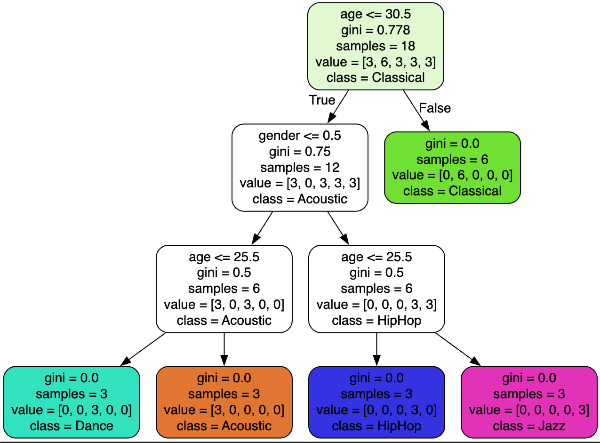

# Machine Learning Fundamentals 🤖

A comprehensive guide and implementation of basic machine learning concepts using Python, focusing on practical applications and step-by-step learning.

## 🎯 Project Overview

This repository contains implementations of fundamental machine learning concepts, including:
- Data preprocessing and cleaning
- Model training and evaluation
- Decision tree classification
- Model persistence and visualization

## 🌳 Decision Tree Visualization



This visualization represents our music recommendation system that:
- Predicts music genre preferences based on age and gender
- Shows classification paths through the decision tree
- Includes gini impurity scores and sample distributions
- Demonstrates 5 different music genre classifications (Acoustic, Classical, Dance, HipHop, Jazz)

## 🛠️ Technologies Used

- **Python 3.x**
- **Key Libraries:**
  - Pandas (Data manipulation)
  - NumPy (Numerical operations)
  - Scikit-learn (Machine learning algorithms)
  - Matplotlib (Data visualization)
  - Jupyter Notebook (Development environment)

## 🚀 Getting Started

### Prerequisites
1. Install Anaconda (includes Python and required packages):
   ```bash
   brew install --cask anaconda   # For macOS
   ```

2. Launch Jupyter Notebook:
   ```bash
   jupyter notebook
   ```

3. Access the notebook at: `localhost:8888/tree`

## 📊 Data Sources

- Music preferences dataset: [Download CSV](https://www.dropbox.com/scl/fi/bieq5udd5w882xy9d86mt/music.csv)
- Video Games Sales dataset: [Kaggle Dataset](https://www.kaggle.com/datasets/gregorut/videogamesales/data)

## 💡 Key Features

1. **Data Processing Pipeline**
   - Data cleaning and preparation
   - Feature selection
   - Train/test splitting

2. **Model Development**
   - Decision Tree implementation
   - Model training and evaluation
   - Accuracy assessment

3. **Advanced Features**
   - Model persistence using joblib
   - Decision tree visualization
   - Performance metrics analysis


## 📄 License

This project is licensed under the MIT License - see the [LICENSE](LICENSE) file for details.
